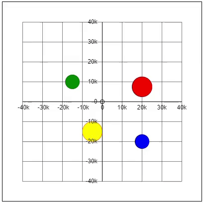
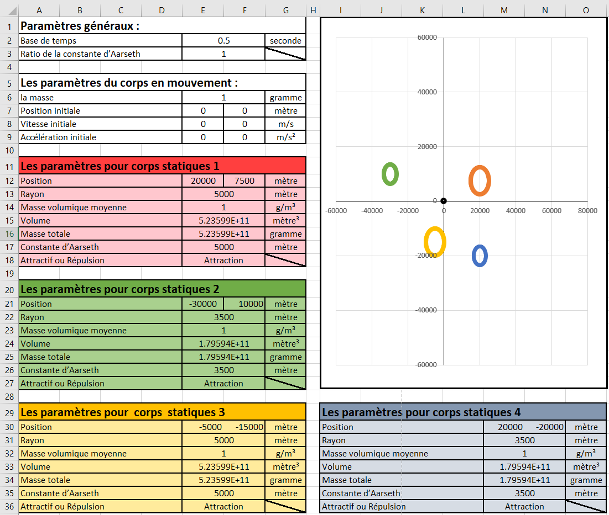

# Gravity-Simulator

## Table of Contents
<ul dir="auto">
  <li><a href="#screen-shots">Screen shots</a></li>
  <li><a href="#description">Description</a></li>
  <li><a href="#technologies-used">Technologies used</a></li>
  <li><a href="#author-info">Author Info</a></li>
</ul>

## Screen shots

  

  
## Description

## Technologies used
<ul>
  <li>Microsoft Excel</li>
</ul>

## Author-info
LinkedIn: www.linkedin.com/in/léandre-benoit
